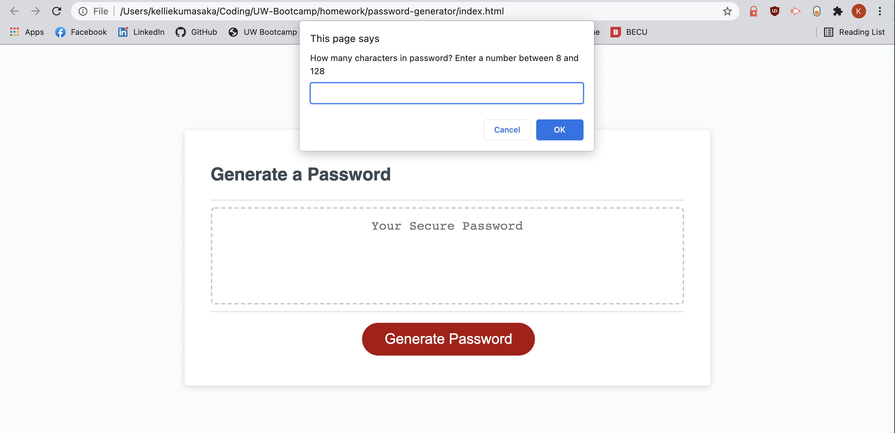
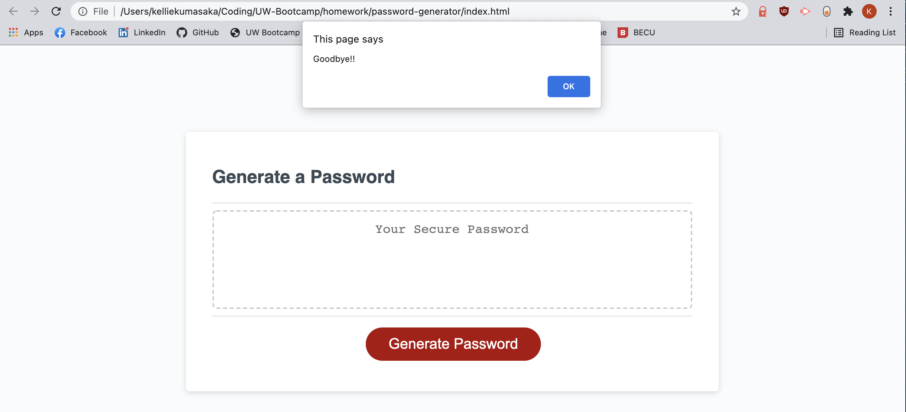
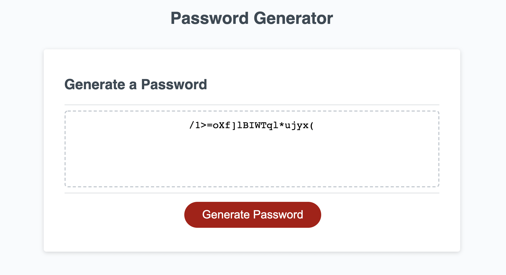
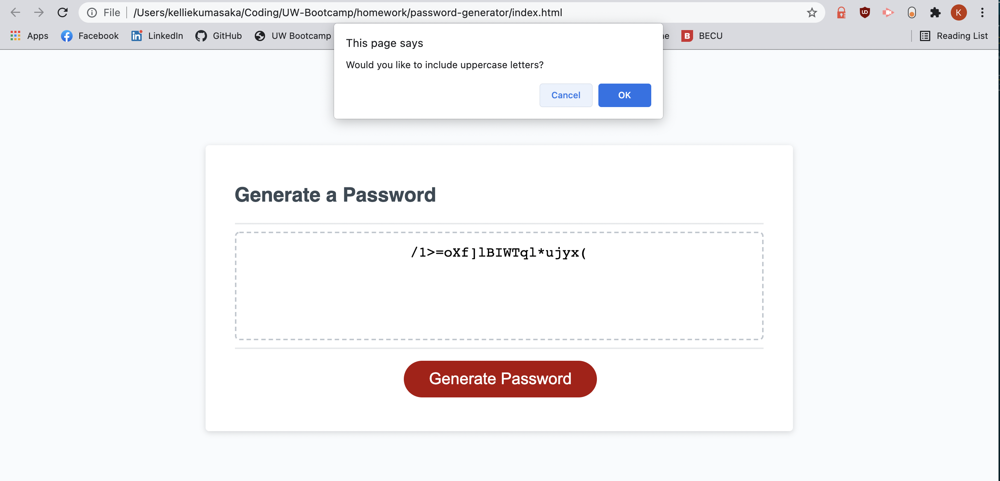

# password-generator

This assignment was to create a working password randomizer that would generate a string of characters based on the parameters that the user sets. In addition, this should be able to continue to loop, no matter how many times you wanted to generate a password, as well as break out of the loop if so desired.

## Deployment

My deployed version of the generator can be found [here](https://kelliekumasaka.github.io/password-generator/).

## Contents

The CSS is untouched, so the website itself should look the same as when received. When the "Generate" button is clicked, the following window pops up.

If you decide that you do not want a password, your window will show the following: 

When you do want to have a password generated, after going through all of the prompts, your password will be generated!

If you decide that you want another password made for you, your old password will stay, but will be replaced after going through all of the prompts.

## Summary

This page is a successful deployment of a version of a random password generator. 